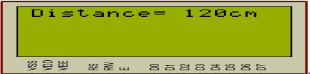

System Requirements

Implement the following system to measure the distance using ultrasonic sensor
HC-SR04 with the specifications listed below:
1. Use ATmega32 Microcontroller with frequency 8Mhz.
2. Measure the distance using the Ultrasonic sensor HC-SR04.
3. The LCD should display the distance value like that:

4. The project should be design and implemented based on the layered architecture model as follow : 

