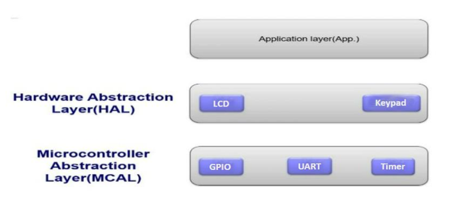
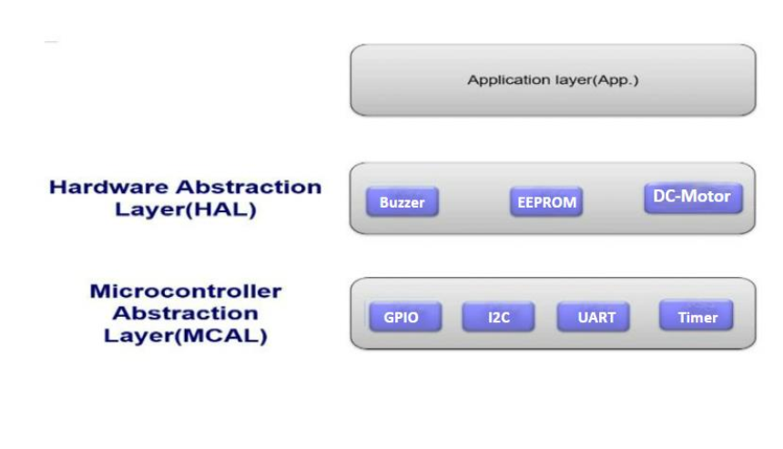

System Requirements :
- Implement the Door Locker Security System to unlock a door using a password.
with the specifications listed below:
1) Use two ATmega32 Microcontrollers with frequency 8Mhz.
2) The project should be design and implemented based on the layered architecture
model as follow:
ℳc1 → HMI_ECU (Human Machine Interface) with 2X16 LCD and 4x4 keypad.

ℳc2 → Control_ECU with EEPROM, Buzzer, and DC-Motor.

3)HMI_ECU is just responsible interaction with the user just take inputs through keypad and display
messages on the LCD.
4)CONTROL_ECU is responsible for all the processing and decisions in the system like password
checking, open the door and activate the system alarm
